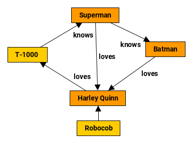

# Java yEd

This is a yEd graph file generator written in Java.
It allows to create:

- Nodes with labels
- Node types (optional)
- Directed edges between two nodes
- Edge labels (optional)
- Edge types (optional)




## Code examples

Example code is available in the following files: 

- [Examples.java](src/main/java/de/adrianwilke/javayed/Examples.java)
- [YedDocTest.java](src/test/java/de/adrianwilke/javayed/YedDocTest.java)
- [IoTest.java](src/test/java/de/adrianwilke/javayed/IoTest.java)


### Example A

```java
// Set file to write
File file = new File("exampleA.yEd.graphml");
System.out.println("Example file: " + file.getAbsolutePath());

// Create document
YedDoc yedDoc = new YedDoc().initialize();

// Create nodes
String a = yedDoc.createNode("Adrian");
String b = yedDoc.createNode("Benjamin");
String c = yedDoc.createNode("Caesar");

// Create edges
yedDoc.createEdge(a, b);
yedDoc.createEdge(b, c);
yedDoc.createEdge(c, a);

// Write file
Io.write(yedDoc.getDocument(), file);
```


### Example B

```java
// Set file to write
File file = new File("exampleB.yEd.graphml");
System.out.println("Example file: " + file.getAbsolutePath());

// Create and configure a document
YedDoc yedDoc = new YedDoc().initialize();
yedDoc.setFontFamily("Roboto");
yedDoc.setFontSize(14);
yedDoc.setFontStyle("bold");

// Create nodes of different types
int hero = 0;
String s = yedDoc.createNode("Superman", hero);
String b = yedDoc.createNode("Batman", hero);
String h = yedDoc.createNode("Harley Quinn", hero);
int robot = 1;
String r = yedDoc.createNode("Robocob", robot);
String t = yedDoc.createNode("T-1000 ", robot);

// Create edges of different types
int knows = 0;
String knowsLabel = "knows";
yedDoc.createEdge(s, b, knowsLabel, knows);
yedDoc.createEdge(t, s, knowsLabel, knows);
int loves = 1;
String lovesLabel = "loves";
yedDoc.createEdge(s, h, lovesLabel, loves);
yedDoc.createEdge(b, h, lovesLabel, loves);
yedDoc.createEdge(h, t, lovesLabel, loves);
Integer unknown = null;
String unknownLabel = null;
yedDoc.createEdge(r, h, unknownLabel, unknown);

// Write file
Io.write(yedDoc.getDocument(), file);
```


## How to use the yEd Graph Editor

- Download yEd at https://www.yworks.com/products/yed
- Open a generated file
- Click `Tools` > `Fit Node to Label` > Ok
- Click `Layout` > `Organic` (e.g.) > Ok
- At `Palette` > `Current Elements` right-click on an element and click `Select Matching Elements`
- Customize the elements according to your taste

You can also use yEd Live at https://www.yworks.com/yed-live/


## Usage

Download the latest [release](releases/) or current [code](archive/master.zip).


### Usage of Maven and GitHub Packages

Add the following lines to your pom.xml:

```xml
<dependencies>
	<!-- https://github.com/adibaba/java-yed -->
	<dependency>
		<groupId>de.adrianwilke</groupId>
		<artifactId>java-yed</artifactId>
		<version>(0,1]</version>
	</dependency>
</dependencies>

[...]

<distributionManagement>
	<repository>
		<id>github-adibaba-java-yed</id>
		<name>GitHub adibaba java-yed Apache Maven Packages</name>
		<url>https://maven.pkg.github.com/adibaba/java-yed</url>
	</repository>
</distributionManagement>
```

To use GitHub Packages, you also have to edit your Maven settings.xml and to create a personal access token.
A description on how to set up the settings.xml is available at [GitHub Help: Configuring Apache Maven for use with GitHub Packages](https://help.github.com/en/packages/using-github-packages-with-your-projects-ecosystem/configuring-apache-maven-for-use-with-github-packages#authenticating-to-github-packages).
Token creation is described at [GitHub Help: Creating a personal access token for the command line](https://help.github.com/en/github/authenticating-to-github/creating-a-personal-access-token-for-the-command-line).


## Deployment

- Remove "-SNAPSHOT" from version
- Create a tag: `git tag -a 0.0.0 -m "0.0.0"`
- Push the tag' `git push --tags`
- Create a release from [tags/](tags/) and attach binaries